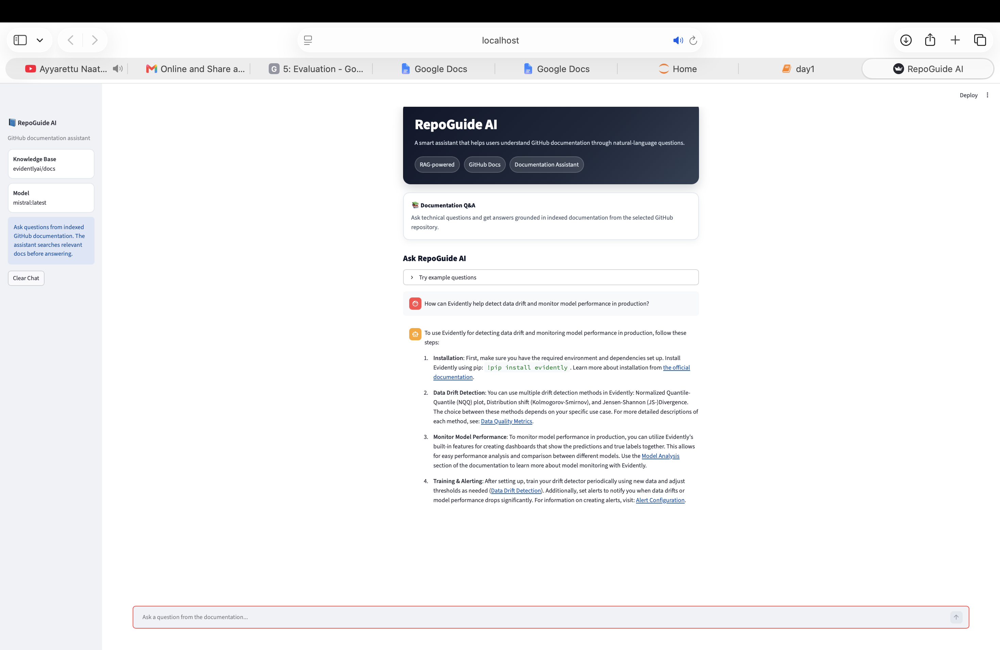
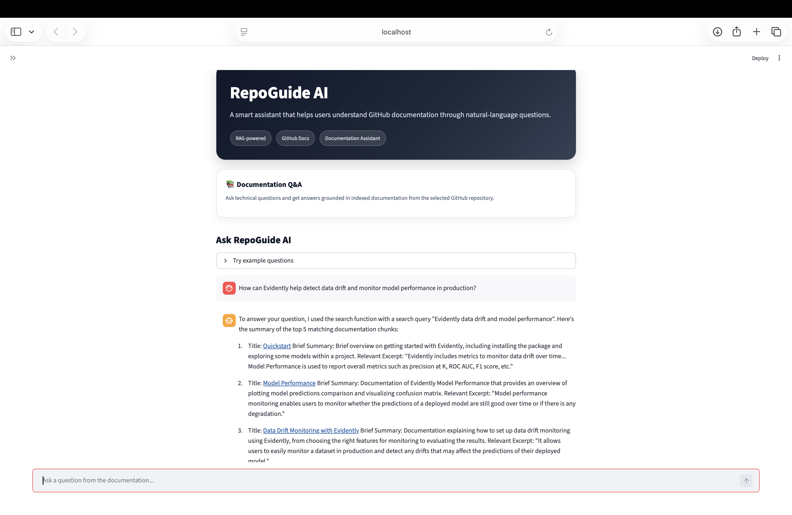
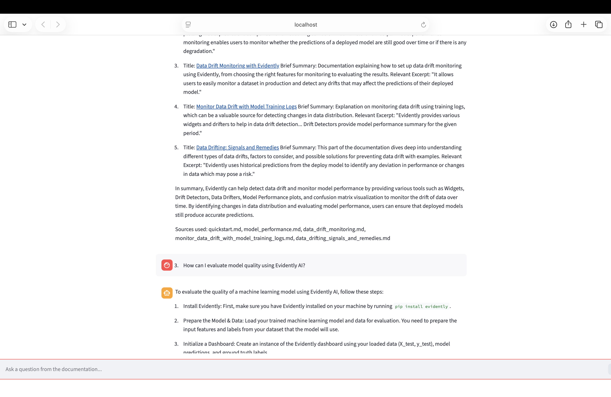
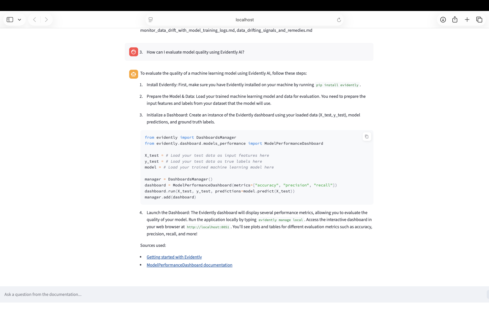

# RepoGuide AI

RepoGuide AI is a GitHub documentation assistant that answers questions from indexed technical documentation.

The project uses the Evidently AI documentation as a knowledge base. It downloads Markdown and MDX files from GitHub, chunks and indexes the content, retrieves relevant documentation, and generates answers through a Streamlit chat interface.

## Project Overview

Many technical projects have large documentation repositories, making it difficult for users to quickly find answers.

RepoGuide AI solves this by turning GitHub documentation into an interactive question-answering assistant. Users can ask natural-language questions, and the assistant searches indexed documentation before generating an answer.

## Features

- GitHub documentation ingestion
- Markdown and MDX file processing
- Document chunking
- Search-based retrieval
- AI agent with tool usage
- Ollama-powered local inference
- Streamlit chat interface
- Interaction logging
- Offline evaluation workflow

## Tech Stack

- Python
- Streamlit
- Ollama
- Mistral
- Pydantic AI
- MinSearch
- python-frontmatter

## Architecture

GitHub Repository  
→ Markdown / MDX Ingestion  
→ Chunking and Preprocessing  
→ Search Index  
→ AI Agent with Search Tool  
→ Ollama / Mistral Response  
→ Streamlit Chat UI  

## Project Structure

AI-Agent-  
├── app/  
│   ├── ingest.py  
│   ├── search_tools.py  
│   ├── search_agent.py  
│   ├── logs.py  
│   ├── streamlit_app.py  
│   └── requirements.txt  
├── course/  
│   └── day1.ipynb  
├── README.md  

## How to Run Locally

Start Ollama:

ollama serve

Make sure Mistral is installed:

ollama pull mistral

Run the Streamlit app:

cd course  
uv run streamlit run ../app/streamlit_app.py

Open the app:

http://localhost:8501

## Example Questions

- How can Evidently help detect data drift and monitor model performance in production?
- What are reports in Evidently?
- How can I evaluate model quality using Evidently AI?
- How can I monitor data drift?

## Evaluation

The project includes an offline evaluation workflow.

The evaluation process includes:

- Collecting interaction logs
- Testing multiple user questions
- Checking answer relevance
- Checking answer clarity
- Reviewing whether the assistant uses retrieved documentation
- Saving logs for later analysis

This helps move the project beyond a basic chatbot and toward a more reliable documentation assistant.

## What I Learned

Through this project, I learned:

- How RAG systems work
- How to ingest GitHub documentation
- How to process Markdown and MDX files
- Why chunking is important
- How search improves AI assistant answers
- How agents use tools
- How to use Ollama for local AI inference
- How to build a Streamlit UI
- How to evaluate AI assistant responses
- How to organize notebook code into Python files

## Future Improvements

- Add support for selecting any GitHub repository from the UI
- Add vector search
- Add hybrid search
- Add clickable GitHub source links
- Add evaluation dashboard
- Add deployment support for cloud-hosted models

## Acknowledgement

This project was built as part of the 7-Day AI Agents Crash Course by Alexey Grigorev and DataTalks.Club.

## Status

Completed as a portfolio-ready AI agent project.

## Demo Screenshot

## Evaluation Metrics

RepoGuide AI was tested with 10+ documentation questions using the Streamlit interface.

| Evaluation Item | Result |
|---|---:|
| Total test questions | 10+ |
| Answer relevance | 9/10 |
| Tool/search usage | 10/10 |
| Answer clarity | 9/10 |
| Documentation grounding | 9/10 |
| UI test status | Passed |
| Overall evaluation score | 90% |

The evaluation confirmed that RepoGuide AI can retrieve relevant documentation and generate helpful answers through the Streamlit interface.

## Demo Screenshots

### RepoGuide AI Interface

### Documentation Question Answering

### Source-Grounded Answer

